# BASE PRP Aanmaken

## Feature: Argumenten $ARGUMENTS

Genereer een complete PRP (Product Requirements Proposal/Document) voor de implementatie van een feature, gebaseerd op diepgaand en grondig onderzoek. Zorg ervoor dat rijke context wordt meegegeven aan de AI via de PRP om een één-pass implementatiesucces mogelijk te maken door middel van zelfvalidatie en iteratieve verfijning.

Het AI-agent krijgt alleen de context die je toevoegt aan de PRP en zijn eigen trainingsdata. Ga ervan uit dat het AI-agent toegang heeft tot de codebase en dezelfde kennis-cutoff als jij, dus het is belangrijk dat je onderzoeksbevindingen zijn opgenomen of waarnaar verwezen wordt in de PRP. Het agent heeft webzoekmogelijkheden, dus geef URL's naar documentatie en voorbeelden door.

## Te volgen werkinstructie

```mermaid
flowchart TD
    Start([Start: Maak BASE PRP]) --> Input["Ontvang ARGUMENTEN<br/>Feature specificatie"]
    
    Input --> ResearchStart["Begin Onderzoeksproces<br/>Optimaliseer voor succes, niet snelheid"]
    
    ResearchStart --> CodebaseAnalysis["Codebase Analyse in Detail"]
    
    CodebaseAnalysis --> CA1["Maak duidelijke todos voor codebase zoeken"]
    CA1 --> CA2["Start subagents voor patroon zoeken"]
    CA2 --> CA3["Identificeer benodigde bestanden om te refereren"]
    CA3 --> CA4["Noteer bestaande conventies"]
    CA4 --> CA5["Controleer testpatronen voor validatie"]
    CA5 --> CA6["Lees CLAUDE.md bestanden:<br/>./CLAUDE.md<br/>./app_name/CLAUDE.md<br/>./PRP/claude_md/CLAUDE-AVISEO.md"]
    CA6 --> CA7["Gebruik batch tools voor diep patroon zoeken"]
    
    CA7 --> CACheck{"Codebase analyse<br/>compleet?"}
    CACheck -->|Nee| CAMissing["Identificeer ontbrekende elementen"]
    CAMissing --> CA1
    
    CACheck -->|Ja| ExternalResearch["Extern Onderzoek op Schaal"]
    
    ExternalResearch --> ER1["Maak todos voor extern onderzoek"]
    ER1 --> ER2["Start subagents voor online onderzoek"]
    ER2 --> ER3["Verzamel library documentatie URLs"]
    ER3 --> ER4["Vind implementatie voorbeelden<br/>GitHub/StackOverflow/blogs"]
    ER4 --> ER5["Documenteer best practices"]
    ER5 --> ER6["Noteer veelvoorkomende valkuilen"]
    ER6 --> ERCritical{"Kritieke documentatie<br/>gevonden?"}
    
    ERCritical -->|Ja| ER7["Voeg .md bestanden toe aan PRP/ai_docs<br/>Refereer in PRP met redenering"]
    ERCritical -->|Nee| ER8["Ga door met verzamelde info"]
    
    ER7 --> ERCheck{"Extern onderzoek<br/>compleet?"}
    ER8 --> ERCheck
    
    ERCheck -->|Nee| ERMissing["Identificeer onderzoekshiaten"]
    ERMissing --> ER1
    
    ERCheck -->|Ja| ClarificationCheck{"Gebruiker verduidelijking<br/>nodig?"}
    
    ClarificationCheck -->|Ja| UC1["Vraag gebruiker om verduidelijking"]
    UC1 --> UCWait["Wacht op gebruiker reactie"]
    UCWait --> UCReceived{"Verduidelijking<br/>ontvangen?"}
    UCReceived -->|Nee| UCWait
    UCReceived -->|Ja| UCProcess["Verwerk verduidelijking"]
    UCProcess --> AllResearchDone
    
    ClarificationCheck -->|Nee| AllResearchDone["Alle onderzoek voltooid"]
    
    AllResearchDone --> UltraThink["ULTRADENK over PRP aanpak<br/>Plan gedetailleerde todos"]
    
    UltraThink --> PRPGen["Begin PRP Generatie<br/>Gebruik PRP/templates/prp_base.md"]
    
    PRPGen --> Context["Voeg Kritieke Context toe:<br/>Documentatie URLs<br/>Code voorbeelden<br/>Valkuilen<br/>Patronen<br/>Best practices"]
    
    Context --> Blueprint["Maak Implementatie Blauwdruk:<br/>Pseudocode aanpak<br/>Refereer echte bestanden<br/>Foutafhandeling strategie<br/>Geordende takenlijst"]
    
    Blueprint --> Validation["Definieer Validatie Poorten:<br/>ruff check --fix<br/>mypy .<br/>pytest tests/ -v<br/>Extra creatieve poorten"]
    
    Validation --> ValCheck{"Alle validatie poorten<br/>uitvoerbaar door AI?"}
    
    ValCheck -->|Nee| ValFix["Herstel validatie poorten<br/>Maak uitvoerbaar"]
    ValFix --> Validation
    
    ValCheck -->|Ja| SavePRP["Bewaar PRP naar:<br/>PRP/output/create/feature-naam.md"]
    
    SavePRP --> QualityCheck["Voer Kwaliteits Checklist uit"]
    
    QualityCheck --> QC1{"Context inbegrepen?"}
    QC1 -->|Nee| QCFix1["Voeg ontbrekende context toe"]
    QCFix1 --> Context
    
    QC1 -->|Ja| QC2{"Validatie poorten<br/>uitvoerbaar?"}
    QC2 -->|Nee| QCFix2["Herstel validatie poorten"]
    QCFix2 --> Validation
    
    QC2 -->|Ja| QC3{"Refereert bestaande<br/>patronen?"}
    QC3 -->|Nee| QCFix3["Voeg patroon referenties toe"]
    QCFix3 --> Context
    
    QC3 -->|Ja| QC4{"Duidelijk implementatie<br/>pad?"}
    QC4 -->|Nee| QCFix4["Verduidelijk implementatie"]
    QCFix4 --> Blueprint
    
    QC4 -->|Ja| QC5{"Foutafhandeling<br/>gedocumenteerd?"}
    QC5 -->|Nee| QCFix5["Voeg foutafhandeling toe"]
    QCFix5 --> Blueprint
    
    QC5 -->|Ja| Score["Score PRP vertrouwen<br/>Schaal 1 tot 10"]
    
    Score --> ScoreCheck{"Score >= 8?"}
    
    ScoreCheck -->|Nee| Improve["Identificeer benodigde verbeteringen"]
    Improve --> ImprovementType{"Wat heeft<br/>verbetering nodig?"}
    
    ImprovementType -->|Onderzoek| ResearchStart
    ImprovementType -->|Context| Context
    ImprovementType -->|Implementatie| Blueprint
    ImprovementType -->|Validatie| Validation
    
    ScoreCheck -->|Ja| Complete["PRP Compleet<br/>Klaar voor één-stap implementatie"]
    
    Complete --> End([Einde: PRP Gegenereerd])
    
    style Start fill:#90EE90
    style End fill:#90EE90
    style UltraThink fill:#FFB6C1
    style AllResearchDone fill:#87CEEB
    style CACheck fill:#FFE4B5
    style ERCheck fill:#FFE4B5
    style ClarificationCheck fill:#FFE4B5
    style ValCheck fill:#FFE4B5
    style ScoreCheck fill:#FFE4B5
    style QC1 fill:#FFE4B5
    style QC2 fill:#FFE4B5
    style QC3 fill:#FFE4B5
    style QC4 fill:#FFE4B5
    style QC5 fill:#FFE4B5
```



## Uitvoeringsproces

### Lees en bestudeer de werkinstructie in het Mermaid diagram

Volg deze instructie nauwgezet. Gebruik onderstaande tekst voor verheldering en het verkrijgen van verdere context.

### Onderzoeksproces

> Tijdens het onderzoeksproces, creëer **duidelijke taken** en spawn zoveel **agents en subagents** als nodig is met behulp van de batchtools. Hoe dieper het onderzoek dat je hier doet, hoe beter de PRP zal zijn. We optimaliseren voor de kans op succes en niet voor snelheid.

1.  **Diepgaande Codebase Analyse**

      * Creëer duidelijke taken en spawn subagents om de codebase te doorzoeken op **vergelijkbare features/patronen**. Denk goed na en plan je aanpak.
      * Identificeer alle **benodigde bestanden** waarnaar moet worden verwezen in de PRP.
      * Noteer alle **bestaande conventies** om te volgen.
      * Controleer bestaande **testpatronen** voor de validatieaanpak.
      * Lees **de relevante** CLAUDE.md-bestanden in het project:
          * `./CLAUDE.md` (root van het project)
          * `./[app_name]/CLAUDE.md` (in de apps die betrokken zijn bij de wijziging)
      * Lees `./PRP/claude_md/CLAUDE-AVISEO.md`
      * Gebruik de batchtools om subagents te spawnen om de codebase te doorzoeken op vergelijkbare features/patronen.

2.  **Externe Onderzoek op Schaal**

      * Creëer duidelijke taken en spawn subagents met instructies om diepgaand onderzoek te doen naar vergelijkbare features/patronen online en voeg **URL's naar documentatie en voorbeelden** toe.
      * Bibliotheekdocumentatie (voeg **specifieke URL's** toe).
      * Voeg voor kritieke documentatiestukken een `.md`-bestand toe aan `PRP/ai_docs` en verwijs ernaar in de PRP met duidelijke redenering en instructies.
      * Implementatievoorbeelden (GitHub/StackOverflow/blogs).
      * Best practices en veelvoorkomende valkuilen die tijdens onderzoek zijn gevonden.
      * Gebruik de batchtools om subagents te spawnen om online te zoeken naar vergelijkbare features/patronen en voeg URL's naar documentatie en voorbeelden toe.

3.  **Gebruikersverduidelijking**

      * Vraag om verduidelijking indien nodig.

### PRP Generatie

Gebruik `PRP/templates/prp_base.md` als template:

#### Minimale Kritieke Context om op te Nemen en door te Geven aan het AI-agent als onderdeel van de PRP

  * **Documentatie**: URL's met specifieke secties.
  * **Code Voorbeelden**: Echte fragmenten uit de codebase.
  * **Valkuilen**: Bibliotheek-eigenaardigheden, versieproblemen.
  * **Patronen**: Bestaande aanpakken om te volgen.
  * **Best Practices**: Veelvoorkomende valkuilen gevonden tijdens onderzoek.

#### Implementatie Blueprint

  * Begin met pseudocode die de aanpak toont.
  * Verwijs naar echte bestanden voor patronen.
  * Voeg een strategie voor foutafhandeling toe.
  * Lijst taken op die moeten worden voltooid om de PRP te vervullen, in de volgorde waarin ze moeten worden voltooid. Gebruik het patroon in de PRP met **informatiedichte trefwoorden**.

#### Validatie Gates (Moet uitvoerbaar zijn door het AI-agent)

```bash
# Syntaxis/Stijl
ruff check --fix && mypy .

# Unit Tests
uv run pytest tests/ -v
```

Hoe meer validatiegates, hoe beter, maar zorg ervoor dat ze **uitvoerbaar zijn door het AI-agent**. Voeg tests, mcp-servers en andere relevante validatiegates toe. Wees creatief met de validatiegates.

**\_ CRUCIAAL NADAT JE KLAAR BENT MET HET ONDERZOEKEN EN VERKENNEN VAN DE CODEBASE, VOORDAT JE BEGINT MET HET SCHRIJVEN VAN DE PRP \_**

**\_ ULTRA-DENK NA OVER DE PRP EN PLAN JE AANPAK IN GEDETAILLEERDE TAKEN ALVORENS TE BEGINNEN MET HET SCHRIJVEN VAN DE PRP \_**

## Output

Opslaan als: `PRP/output/create/{feature-name}.md`

### Kwaliteitscontrolelijst

  * [ ] Alle benodigde context inbegrepen
  * [ ] Validatiegates zijn uitvoerbaar door AI
  * [ ] Verwijst naar bestaande patronen
  * [ ] Duidelijk implementatiepad
  * [ ] Foutafhandeling gedocumenteerd

Beoordeel de PRP op een schaal van 1-10 (vertrouwensniveau om te slagen in één-pass implementatie met behulp van Claude-code).

Onthoud: Het doel is **één-pass implementatiesucces** door **uitgebreide context**.
