# Uitvoeren BASE PRP

Implementeer een feature met behulp van het PRP bestand.

## PRP Bestand: $ARGUMENTS

## Te volgen werkinstructie

```mermaid
flowchart TD
    Start([Start: Uitvoeren BASE PRP]) --> Input["Ontvang PRP Bestand:<br/>ARGUMENTEN"]
    
    Input --> LoadPRP["Laad PRP"]
    
    LoadPRP --> LP1["Lees gespecificeerd PRP bestand"]
    LP1 --> LP2["Begrijp alle context en vereisten"]
    LP2 --> LP3["Volg alle instructies in PRP"]
    LP3 --> LP4["Controleer of alle context beschikbaar is"]
    
    LP4 --> ContextCheck{"Alle benodigde context<br/>beschikbaar?"}
    
    ContextCheck -->|Nee| ExtendResearch["Breid onderzoek uit indien nodig"]
    ExtendResearch --> WebSearch["Doe meer webzoekopdrachten"]
    WebSearch --> CodebaseExplore["Verken codebase verder"]
    CodebaseExplore --> LP4
    
    ContextCheck -->|Ja| UltraThink["ULTRADENK Fase"]
    
    UltraThink --> UT1["Maak uitgebreid plan<br/>dat alle vereisten adresseert"]
    UT1 --> UT2["Verdeel PRP in duidelijke todos<br/>met TodoWrite tool"]
    UT2 --> UT3["Gebruik agents, subagents<br/>en batchtool"]
    UT3 --> UT4["Zorg voor EXTREEM DUIDELIJKE taken<br/>voor subagents"]
    UT4 --> UT5["Zorg dat elke subagent<br/>PRP leest en context begrijpt"]
    UT5 --> UT6["Identificeer implementatiepatronen<br/>uit bestaande code"]
    UT6 --> UT7["Verzamel echte context voor imports,<br/>bestandsnamen, functienamen"]
    
    UT7 --> PlanReady{"Plan uitgebreid<br/>en duidelijk?"}
    
    PlanReady -->|Nee| RefineP["Verfijn plan"]
    RefineP --> UT1
    
    PlanReady -->|Ja| Execute["Voer het plan uit"]
    
    Execute --> E1["Voer PRP stap voor stap uit"]
    E1 --> E2["Implementeer alle code"]
    
    E2 --> ImplementCheck{"Implementatie<br/>compleet?"}
    
    ImplementCheck -->|Nee| ContinueImpl["Ga door met implementeren"]
    ContinueImpl --> E1
    
    ImplementCheck -->|Ja| Validate["Valideer"]
    
    Validate --> V1["Voer elk validatiecommando uit"]
    V1 --> V2["Controleer validatieresultaten"]
    
    V2 --> ValidationPass{"Alle validaties<br/>geslaagd?"}
    
    ValidationPass -->|Nee| V3["Herstel fouten met<br/>foutpatronen uit PRP"]
    V3 --> V4["Voer validaties opnieuw uit"]
    V4 --> V2
    
    ValidationPass -->|Ja| V5["Herlees PRP om te valideren dat<br/>implementatie aan vereisten voldoet"]
    
    V5 --> RequirementsCheck{"Implementatie voldoet<br/>aan alle vereisten?"}
    
    RequirementsCheck -->|Nee| FixReq["Herstel ontbrekende vereisten"]
    FixReq --> Execute
    
    RequirementsCheck -->|Ja| Complete["Voltooiingsfase"]
    
    Complete --> C1["Zorg dat alle checklist items gedaan zijn"]
    C1 --> ChecklistDone{"Alle checklist<br/>items compleet?"}
    
    ChecklistDone -->|Nee| CompleteItems["Voltooi ontbrekende items"]
    CompleteItems --> C1
    
    ChecklistDone -->|Ja| C2["Voer finale validatiesuite uit"]
    
    C2 --> FinalValidation{"Finale validatie<br/>geslaagd?"}
    
    FinalValidation -->|Nee| FixFinal["Herstel finale problemen"]
    FixFinal --> Validate
    
    FinalValidation -->|Ja| C3["Rapporteer voltooiingsstatus"]
    C3 --> C4["Lees PRP opnieuw om te verzekeren<br/>dat alles geïmplementeerd is"]
    
    C4 --> FinalCheck{"Alles correct<br/>geïmplementeerd?"}
    
    FinalCheck -->|Nee| IdentifyGaps["Identificeer implementatiehiaten"]
    IdentifyGaps --> Execute
    
    FinalCheck -->|Ja| Success["Implementatie succesvol"]
    
    Success --> RefOption{"Nodig om PRP<br/>opnieuw te raadplegen?"}
    
    RefOption -->|Ja| Reference["Raadpleeg de PRP"]
    Reference --> ReviewAgain["Bekijk specifieke secties"]
    ReviewAgain --> RefOption
    
    RefOption -->|Nee| End([Einde: PRP Succesvol Uitgevoerd])
    
    style Start fill:#90EE90
    style End fill:#90EE90
    style UltraThink fill:#FFB6C1
    style Success fill:#87CEEB
    style ContextCheck fill:#FFE4B5
    style PlanReady fill:#FFE4B5
    style ImplementCheck fill:#FFE4B5
    style ValidationPass fill:#FFE4B5
    style RequirementsCheck fill:#FFE4B5
    style ChecklistDone fill:#FFE4B5
    style FinalValidation fill:#FFE4B5
    style FinalCheck fill:#FFE4B5
    style RefOption fill:#FFE4B5
```

## Uitvoeringsproces

### Lees en bestudeer de werkinstructie in het Mermaid diagram

Volg deze instructie nauwgezet. Gebruik onderstaande tekst voor verheldering en het verkrijgen van verdere context.

###  PRP Laden

    * Lees het opgegeven PRP-bestand.
    * Begrijp alle **context en vereisten**.
    * Volg alle instructies in de PRP en breid het onderzoek indien nodig uit.
    * Zorg ervoor dat je alle benodigde context hebt om de PRP volledig te implementeren.
    * Doe indien nodig meer **webzoekopdrachten en codebase-verkenning**.

###  ULTRATHINK

    * **Ultrathink** voordat je het plan uitvoert. Creëer een **uitgebreid plan** dat aan alle vereisten voldoet.
    * Deel de PRP op in **duidelijke taken** met behulp van de TodoWrite-tool.
    * Gebruik **agents, subagents en batchtools** om het proces te verbeteren.
    * **Belangrijk**: JE MOET ERVOOR ZORGEN DAT JE UITERST DUIDELIJKE TAKEN HEBT VOOR SUBAGENTS EN VERWIJS NAAR CONTEXT EN ZORG ERVOOR DAT ELKE SUBAGENT DE PRP LEEST EN DE CONTEXT BEGRIJPT.
    * Identificeer **implementatiepatronen** uit bestaande code om te volgen.
    * Raad nooit naar imports, bestandsnamen, functienamen, etc., baseer je **ALTIJD op de realiteit en het verzamelen van echte context**.

### Voer het plan uit

    * Voer de PRP stap voor stap uit
    * Implementeer alle code.

###  Valideer

    * Voer elke validatieopdracht uit.
    * Hoe beter de validatie, hoe zekerder we kunnen zijn dat de implementatie correct is.
    * Los eventuele fouten op.
    * Voer opnieuw uit totdat alles is geslaagd.
    * Lees de PRP altijd opnieuw om de implementatie te valideren en te controleren of deze aan de vereisten voldoet.

###  Voltooi

    * Zorg ervoor dat alle checklistitems zijn voltooid.
    * Voer de definitieve validatiesuite uit.
    * Rapporteer de voltooiingsstatus.
    * Lees de PRP opnieuw om er zeker van te zijn dat je alles hebt geïmplementeerd.

###  Verwijs naar de PRP

    * Je kunt altijd opnieuw naar de PRP verwijzen indien nodig.

**Opmerking**: Als de validatie mislukt, gebruik dan de foutpatronen in de PRP om het probleem op te lossen en opnieuw te proberen.
